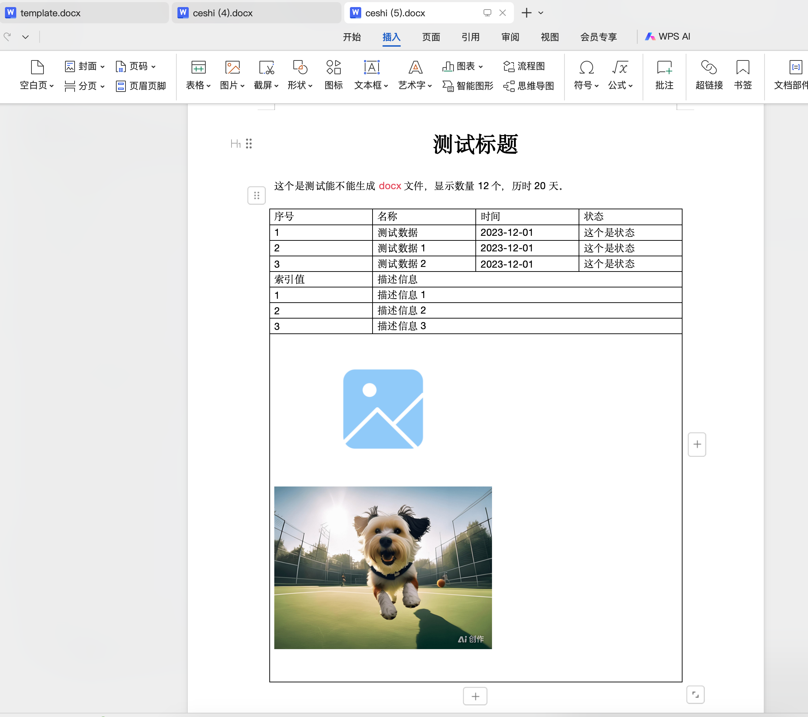

# 纯前端导出 docx 文件

## 安装插件

```bash
# api 具体使用的方式会由于版本不同而不同 可参照代码中的版本
npm install docxtemplater pizzip jszip-utils file-saver docxtemplater-image-module-free
```

## 步骤

- 编辑好 docx 模板，放置在 public 下
- 导出数据即可

## demo


